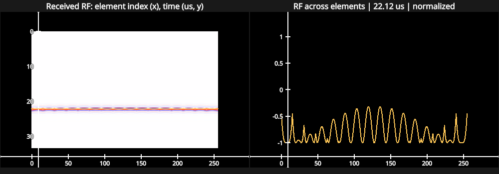
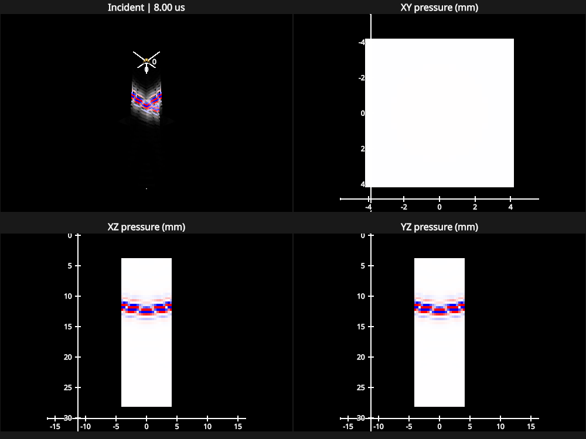
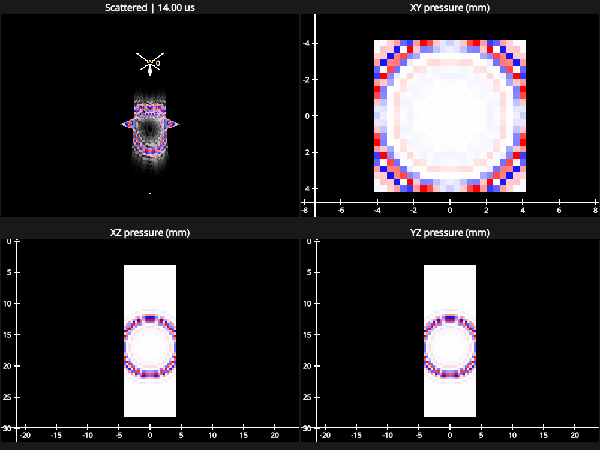

# Incident and scattered wavefields

The 3D explorer simulates pressure inside the notebook and displays three orthogonal planes in a rotatable scene, with
matching 2D views and received RF across the matrix elements. The planes share physical coordinates and a common time
axis. Beamforming is not part of this example.

From the repository root:

```sh
uv run --group plot3d marimo edit examples/wavefield_3d_explorer.py
```

Select a scene and press **Simulate**. The phantom contains signed background scatterers, an anechoic sphere, and two
bright point targets. All scatterers contribute to the calculation, including scatterers outside the observation planes.
Only the displayed scatterer markers may be subsampled; the notebook reports both counts.

The coarse preview setting changes observation spacing, not the simulated scatterer count. Acoustic sampling uses
spacing no greater than half the wavelength at the highest frequency on the simulation grid. Change observation
resolution or transmission settings and simulate again. Time, component, magnitude, gain, and geometry controls reuse
the current result. The simulation can be cancelled between illumination or observation blocks; the receive-RF stage
finishes before a pending cancellation is applied.

## Received RF during playback

The bottom-left panel shows signed received RF with flattened element index on the horizontal axis and time in
microseconds on the vertical axis. Its yellow cursor follows wavefield playback. The bottom-right panel shows the
instantaneous signal across all receive elements, interpolated onto the same physical time. Both views use one fixed RF
peak scale; pressure component, magnitude, and gain controls do not change RF values or rerun the simulation.

RF is computed with the finite receive-element model, including its receive directivity and probe response. It is not
pressure sampled at element centers. The point scene provides a clear round-trip echo; the no-scatterer scene has zero
RF.



## Pressure at arbitrary points

```python
import numpy as np
from fast_simus import (
    Transducer, matrix_aperture, scattered_field_precompute,
    scattered_pfield_spectrum, spectrum_to_wavefield,
)

probe = Transducer(
    matrix_aperture(shape=(2, 2), pitch=(0.0003, 0.0003),
                    size=(0.0002, 0.0002), xp=np, dtype=np.float64),
    model="3d", freq_center=2e6,
)
observers = np.array([[0.001, 0.0, 0.02]])
scatterers = np.array([[0.0, 0.0, 0.015]])
rc = np.array([0.0002])
delays = np.zeros(4)
plan = scattered_field_precompute(observers, scatterers, rc, delays, probe)
spectrum, info = scattered_pfield_spectrum(
    observers, scatterers, rc, delays, probe, plan=plan, component="total",
)
movie = spectrum_to_wavefield(spectrum, info)
```

Observation coordinates have shape `(*grid,3)`, scatterers `(*cloud,3)`, coefficients `(*cloud,)`, and transmit delays
`(element,)`. Lengths are meters and delays seconds. Arrays must share backend, device, and precision. Empty clouds
return zero scattered pressure. Plans borrow the transducer description; do not mutate its arrays. Reused inputs are
checked against the prepared shape and path bounds.

`component` selects `incident`, `scattered` (the default), or `total`. All three components use the same plan, so their
frequency bins and times agree exactly. `iter_scattered_pfield_spectrum` yields `FieldBlock(start, stop, values)` over
flattened observer points, allowing incremental conversion to time-domain pressure. An optional `cancelled` callback is
checked between blocks and raises `InterruptedError` when true. The iterator is eager; its numerical block functions use
backend operations and JAX device loops.

## Physical model and display

The model is linear single scattering in a homogeneous medium:

`P_scattered(f,x) = sum_s G(f,x,s) * rc[s] * P_incident(f,s)`

The incident pressure includes the transmit aperture, pulse, probe response and any elevation lens. Point observations
use isotropic spherical spreading and attenuation. They have no receive aperture, baffle, lens, electrical response or
RF threshold. Received channel RF uses its finite element response instead, while sharing the same scatterer
illumination. A voxel pressure trace is therefore distinct from a transducer channel's electrical RF trace.

The point Green function uses `r_safe=max(r,c/(2*fc))` for phase, attenuation and `1/r_safe` spreading, consistent with
the finite-element regularization. This keeps coincident samples finite; it does not establish accuracy at the
singularity. Coefficients follow the existing arbitrary scattering-strength convention. No extra element-area or `4*pi`
factor is introduced. Multiple scattering, tissue interfaces and heterogeneous refraction are excluded.

Incident and scattered spectra are summed before conversion for total pressure. The notebook stores the two components
and adds their time samples for display, an equivalent linear operation. Each component has a fixed peak scale across
the whole movie, stated in the viewer. Separate component normalization aids inspection; it must not be interpreted as
equal physical amplitude. Gain and magnitude conversion affect only the visualization.

The workspace budget includes a bounded optional illumination cache. Dense returned spectra and stored movie arrays are
additional allocations. Only slice points are evaluated; no dense pressure volume or persistent simulation cache is
created. Imaging-scale runs can take minutes, depending on backend and resolution.

## Example frames and measured cost

These isolated-point frames show signed incident pressure at 8 microseconds and scattered pressure at 14 microseconds.
The three planes intersect at the same physical coordinates; drag the 3D panel to rotate the scene.





On an Apple M4 Max with MLX, the default 10,000-scatterer phantom and coarse preview produced 969 observation points and
280 time samples in 223 seconds using the pressure-only simulation before the RF panels were added; a browser run took
213 seconds. The measured standalone process peak was 143 MiB, MLX peak device allocation 22.3 MiB, and stored pressure
arrays 2.1 MiB. The plan's conservative numerical workspace estimate was 36.9 MiB. These are single-run measurements,
not a real-time guarantee.

On Dell's GTX 1060 Max-Q (CuPy 14.0.1, driver 535.288.01), the same default scene including received RF completed in 887
seconds: 690 seconds for pressure and 198 seconds for RF. It produced 362 RF samples across 256 receive elements. CuPy's
memory pool reserved 25.8 MiB at completion; process peak resident memory was 540 MiB and stored output arrays were 2.8
MiB. Pool reservation includes reusable allocations and is not a measurement of live tensor memory.

Run the small deterministic scene and rendering check without opening the notebook:

```sh
uv run --group plot3d --group test pytest tests/test_scattered_field.py tests/test_wavefield3d_rf.py tests/test_wavefield3d_view.py
RENDERCANVAS_FORCE_OFFSCREEN=1 uv run --group plot3d python examples/wavefield_3d_explorer.py
```

Numerical checks cover complex pressure against an independent reference, common-grid component addition, coefficient
linearity, empty clouds, arrival timing, unchanged inputs, multiple tile budgets, and slice samples against a dense
volume. The plotting check exercises physical transforms and renderer cleanup. NumPy, JAX and MLX were exercised
locally; pressure and finite-element RF checks also passed on Dell's CUDA device, including RF parity with NumPy at a
normalized absolute tolerance of 1e-4.
