Contents lists available at [ScienceDirect](http://www.ScienceDirect.com)

# Computer Methods and Programs in Biomedicine

journal homepage: [www.elsevier.com/locate/cmpb](http://www.elsevier.com/locate/cmpb)

# SIMUS: An open-source simulator for medical ultrasound imaging. Part I: Theory & examples

Damien Garcia

*CREATIS: Centre de Recherche en Acquisition et Traitement de l'Image pour la Santé, Lyon, France*

## a r t i c l e i n f o

*Article history:* Received 20 July 2021 Revised 9 February 2022 Accepted 28 February 2022

*Keywords:* Ultrasonic transducer arrays Computer simulation Ultrasound imaging Open-source codes

## a b s t r a c t

*Background and Objective:* Computational ultrasound imaging has become a well-established methodology in the ultrasound
community. Simulations of ultrasound sequences and images allow the study of innovative techniques in terms of emission
strategy, beamforming, and probe design. There is a wide spectrum of software dedicated to ultrasound imaging, each
having its specificities in its applications and the numerical method.

*Methods:* We describe in this two-part paper a new ultrasound simulator (SIMUS) for MATLAB, which belongs to the MATLAB
UltraSound Toolbox (MUST). The SIMUS software simulates acoustic pressure fields and radiofrequency RF signals for
uniform linear or convex probes. SIMUS is an open-source software whose features are 1) ease of use, 2) time-harmonic
analysis, 3) pedagogy. The main goal was to offer a comprehensive turnkey tool, along with a detailed theory for
pedagogical and research purposes.

*Results:* This article describes in detail the underlying linear theory of SIMUS and provides examples of simulated
acoustic fields and ultrasound images. The accompanying article (part II) is devoted to the comparison of SIMUS with
several software packages: Field II, k-Wave, FOCUS, and the Verasonics simulator. The MATLAB open codes for the
simulator SIMUS are distributed under the terms of the GNU Lesser General Public License, and can be downloaded from
https://www.biomecardio.com/MUST.

*Conclusions:* The simulations described in this part and in the accompanying paper (Part II) show that SIMUS can be
used for realistic simulations in medical ultrasound imaging.

# **1. Introduction**

Computational ultrasound imaging, which uses numerical analysis to solve problems that involve ultrasound wave
propagations, has become a standard methodology in the medical ultrasound imaging community. Before considering *in
vitro* or *in vivo* investigations, computational ultrasound imaging can be used, for example, to 1) analyze ultrasound
sequences and arrays [[1],](#page-10-0) 2) develop or optimize beamforming or post-processing algorithms
[[2],](#page-10-0) 3) explore multiple configurations through serial tests [[3],](#page-10-0) 4) compare with peers in
international challenges [[4].](#page-10-0) Among the freely available ultrasound simulators, Field II
[[5,6]](#page-10-0), and k-Wave [[7,8]](#page-10-0) are arguably the most popular. These MATLAB toolboxes have widely
promoted the use of ultrasound simulations for research purposes, and the number of works that use these tools has been
increasing over the years [(Fig.](#page-1-0) 1). There is a whole range of software packages dedicated to ultrasound
imaging, available for free, as opensource or not. A non-exhaustive list of ultrasound-imaging programs is available on
the k-Wave website.1 These software programs each have their specificities, both in their application and in
the numerical method: propagation to simulate acoustic pressure fields [[9,10]](#page-10-0) and/or backpropagation to
also generate ultrasound images [[5,7]](#page-10-0); two- and/or three-dimensional; solved in the time
[[11]](#page-10-0) or frequency [[12]](#page-10-0) domain; linear [[13]](#page-10-0) and/or non-linear
[[14,15]](#page-10-0); grid-based [[7]](#page-10-0) or mesh-free [[5];](#page-10-0) media with homogeneous
[[6]](#page-10-0) or inhomogeneous speed of sound [[7,11]](#page-10-0); convolutional methods to quickly generate
synthetic B-mode images [[16,17]](#page-10-0).

In this article, we propose a frequency-based ultrasound simulator called SIMUS. The goal was not to bring innovation in
theoretical acoustics. The novelty of SIMUS lies in the computational model, which combines linear models described in
several articles [[18–24]](#page-10-0) and in Schmerr's book [[25].](#page-10-0) As detailed in the following sections,
this simulator is based on far-field (Fraunhofer) and paraxial (Fresnel) acoustic equations. As we will see, the
transducer elements are partitioned along the probe *X*-direction to enable the use of far-field equations. Roughly
speaking, the paraxial approx-

*E-mail addresses:* [damien.garcia@inserm.fr,](mailto:damien.garcia@inserm.fr)
[damien.garcia@creatis.insa-lyon.fr](mailto:damien.garcia@creatis.insa-lyon.fr)

1 [http://www.k-wave.org/acousticsoftware.php.](http://www.k-wave.org/acousticsoftware.php)

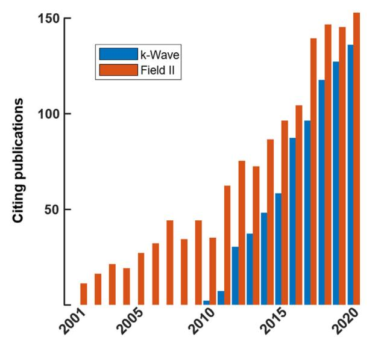

**Fig. 1.** Number of yearly publications that cite [[5]](#page-10-0) (Field II) or [[7]](#page-10-0) (k-Wave). The
citation reports are from Web of Science.

imation is valid if one does not deviate too much from the *X*-*Z* azimuth plane, i.e. if the angles relative to this
plane are small.

SIMUS is the name of the MATLAB main function that simulates ultrasound radiofrequency (RF) signals. The conditions and
assumptions under which SIMUS works are explained in this document. SIMUS is an open-source code that can be adapted by
an advanced user for her/his own purpose. We created SIMUS primarily for educational and research purposes. It was first
intended for students and researchers, as they needed fast, open-source programs for their research projects
[[1,26]](#page-10-0). The ultrasound simulator SIMUS is part of the MUST toolbox (MATLAB UltraSound Toolbox)
[[27],](#page-10-0) which we distribute online under the terms of the GNU Lesser General Public License v3.0
[(www.biomecardio.com/MUST/)](https://www.biomecardio.com/MUST). The MUST toolbox is intended for students and
researchers, both novice or advanced, for teaching or research in ultrasound medical imaging. The website includes many
practical examples that allow a quick understanding of the essentials of ultrasound imaging.

As with Field II [[5],](#page-10-0) FOCUS [[9],](#page-10-0) and k-Wave [[7],](#page-10-0) MATLAB was chosen as the
programming language because of its widespread use in universities and research labs, and its rich repertoire of
built-in functions for data analysis, data processing, and image display. At the time of submission of this paper, only
1-D probes, rectilinear or convex, with elevation focusing, are considered in SIMUS. Although there is a growing
interest in ultrasound imaging with a high number of transducer elements (e.g. 1024) and 2- D matrix arrays
[[28,29]](#page-10-0), it appears that the 1-D configuration with a limited number of channels (typically 64 to 192)
remains by far the most common configuration at present. The main assumptions on which SIMUS relies are

- 1. Linearity,
- 2. Scatterers acting as monopole sources,
- 3. Weak (single) scattering.

In essence, these hypotheses are similar to those in Field II. SIMUS, however, works in the frequency domain using a
timeharmonic analysis. The frequency domain can indeed be more appropriate when dealing with bandpass signals. It can
also easily consider physical aspects that depend on the frequency, such as the directivity of the elements, attenuation
in the tissues, or Rayleigh scattering, for example. For the sake of clarity, the syntax of SIMUS has been standardized
with that of the functions included in the MUST toolbox, and the default settings are those commonly used in medical
ultrasound. SIMUS is the main program that uses another MATLAB function called PFIELD, which calculates one-way or
two-way acoustic pressure fields. SIMUS and PFIELD can be used independently of the other MUST functions. SIMUS
calculates the radiofrequency from the acoustic spectra generated by PFIELD. One or the other function will be mentioned
depending on the context.

This article (*Part I: theory*) is accompanied by a second one (*Part II: comparison with Field II, k-Wave, FOCUS, and
Verasonics*, Cigier A., Varray F. and Garcia D.) This first part describes the linear acoustic theory that underlies
PFIELD. Several approximations and linearizations have been used. It is essential to review them to identify the limits
of PFIELD and under which conditions it can be used. Part I is illustrated with simulations of ultrasound pressure
fields and ultrasound images. The second article (Part II) is devoted to the comparison of the acoustic pressures
generated by PFIELD with those obtained by Field II, k-Wave, FOCUS, and the Verasonics simulator.

In this first-part article, we will outline the theoretical reasoning leading to the equations included in PFIELD. We
will first explain how ultrasound pressure fields are simulated and then address the generation of backscattered
pressure signals. The last section will be illustrated with some realistic examples related to medical imaging.

### **2. PFIELD inside out**

This section describes the theory inside PFIELD. PFIELD simulates the pressure fields in the frequency domain, i.e. it
is assumed that the pressure waves have a time-harmonic dependence such that the pressure is written as:

$$p(\\mathbf{X},t) = \\operatorname{Re} \\left{ \\int\_{-\\infty}^{+\\infty} P(\\mathbf{X},\\omega,t) e^{-i\\omega t}
d\\omega \\right}.$$ (1)

*X* represents a point in the radiated region of interest, *i* = √−1, *t* is
time, ω is the angular frequency. In the following subsections, we will describe how the pressure component *P*(*X*, ω,
*t*) generated from one array element can be approximated, from which the backscattered echoes will be deduced. Although
PFIELD also works for curvilinear arrays, the following sections describe the theory in the context of a rectilinear
probe [(Fig.](#page-2-0) 2). The interested reader can refer to the PFIELD code2 to learn about the slight
modifications required for a convex probe. To estimate the waves that are backscattered by a medium of point-like
scatterers, one must first calculate the acoustic pressure radiated by a single element transducer and an ultrasound
array. As we will see, the width (= 2*b*, see [Fig.](#page-2-0) 2) and height (*h*) of the element transducers are two
key parameters. Recalling that only 1-D arrays will be addressed, elevation focusing will be taken into consideration.

#### *2.1. Overview of the problem*

We will use the conventional coordinate system for a rectilinear array [(Fig.](#page-2-0) 2), i.e. *X* along the
azimuthal direction, *Y* for the elevation, and *Z* describing the axial position. A similar system, noted in lowercase
letters (*x,y,z*), will be applied for individual elements or sub-elements [(Fig.](#page-2-0) 3): i.e. *x, y, z* all
equal zero at the center of an individual (sub-)element. The model starts with the Rayleigh-Sommerfeld integral, which
describes an isolated element behaving like a baffled piston that vibrates on the *x*-*y* plane [(Fig.](#page-2-0) 4).
From the pressure waves radiated by a single element will follow those of the ultrasound probe. The distance between a
point *x* = (*x* ,*y* ,0)

2 [https://www.biomecardio.com/MUST.](https://www.biomecardio.com/MUST)

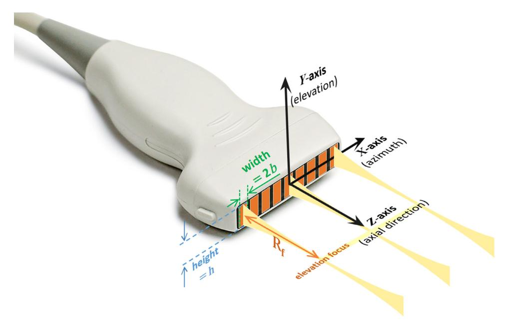

Fig. 2. Coordinate system for a rectilinear array. In this paper, the height of an element is noted h, and its width is
2b. $R_f$ stands for the distance to the elevation focus.

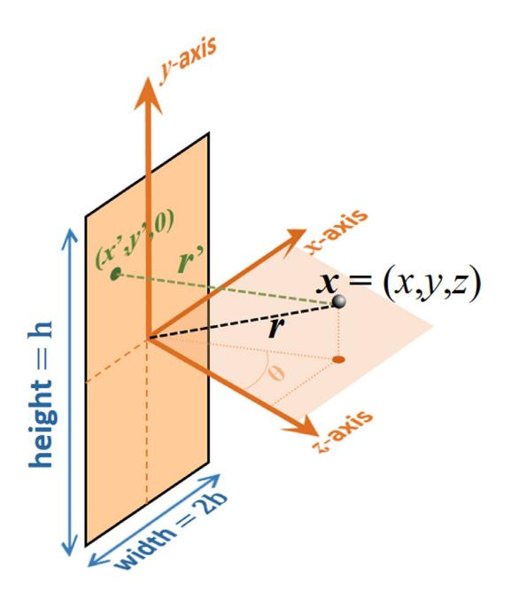

**Fig. 3.** Coordinate system for an individual element. The distance r' is approximated by the expression (6).

of the piston and a point x = (x,y,z) in the field (Fig. 3), is noted

$$r' = \\sqrt{(x - x')^2 + (y - y')^2 + z^2}.$$ (2)

The distance between the center of the piston and a point x in the field (Fig. 3), is noted

$$r = \\sqrt{x^2 + y^2 + z^2}. (3)$$

One-dimensional linear and convex arrays for medical ultrasound contain an acoustic lens that focuses the ultrasound
waves on the elevation plane. In SIMUS and PFIELD, the incident waves can be focused on the elevation plane at a given
distance $R_f$ (Fig. 2 and Fig. 4), whose value is generally provided by the probe manufacturer. A strategy for
simulating elevation focusing is to use a large parabolic element [30] or to position small elements onto a

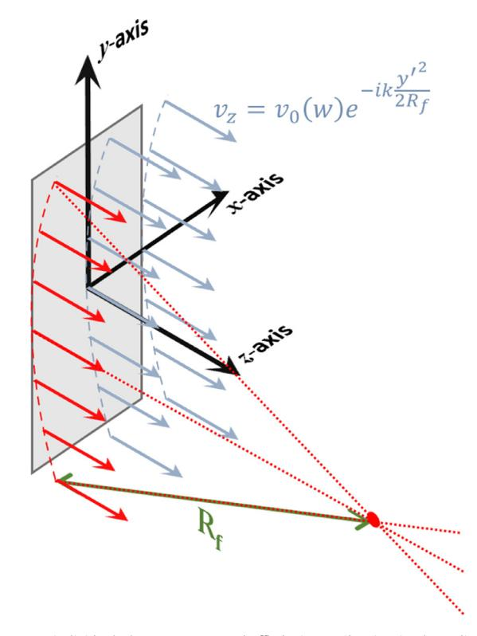

**Fig. 4.** An individual element acts as a baffled piston vibrating in the z-direction. The velocities are delayed to
simulate the elevation focusing induced by an acoustic lens.

parabolic surface [31]. Another strategy is to modify the piston velocity delays along the elevation direction (Fig. 4),
as described by Eq. (3.27) in \[25\]:

$$v(y',\\omega) = v_0(\\omega)e^{-ik\\frac{y'^2}{2R_f}}$$ if $|y'| \\le \\frac{h}{2}$ , 0 otherwise (4)

with $v_0(\\omega)$ being the velocity amplitude. The time delays in Eq. (4) (= $y'^2/(2cR_f)$ ) were derived by
assuming that $y' \\ll R_f$ (paraxial approximation, see Eq. (3.24) in [25]).

## 2.2. Acoustic field of a single array element

Let us consider a planar piston embedded in an infinite rigid baffle, and vibrating along the *z*-direction. The
resulting harmonic pressure P at position $\\mathbf{x} = (x, y, z)$ is given by the Rayleigh-Sommerfeld integral (see
e.g. Eq. (1) in [24] or Eq. 6.19 in [25])

$$P(\\mathbf{x}, \\omega, t) = \\frac{k\\rho c}{2i\\pi} e^{-i\\omega t} \\int\_{-b}^{b} \\int\_{-b/2}^{h/2} \\nu(y',
\\omega) \\frac{e^{ikr'}}{r'} dx' dy', \\tag{5}$$

where $\\rho$ is the medium density, c is the speed of sound, and $k=\\omega/c$ is the wavenumber. Assuming a paraxial
propagation with respect to the z-direction, the distance r' [Eq. (3)] can be rewritten, in the far field, as (see
Appendix)

$$r' \\approx r - x' \\sin \\theta + \\frac{\\left(y - y'\\right)^2}{2r},$$ (6)

where the angle $\\theta$ is defined in Fig. 3. The far-field pressure can thus be approximated by inserting (6) into
(5) and by substituting r for r' in the denominator:

$$P(\\mathbf{x}, \\omega, t) = \\frac{k\\rho c}{2i\\pi} e^{-i\\omega t}$$

$$\\times \\int\_{b}^{b} \\int\_{h/2}^{h/2} \\nu(y', \\omega) \\frac{e^{ik\\left(r - x'\\sin\\theta + \\frac{(y -
y')^2}{2r}\\right)}}{r} dx'dy', \\tag{7}$$

which gives

$$P(\\mathbf{x}, \\omega, t) = \\frac{k\\rho c}{2i\\pi} \\frac{e^{ikr}}{r} e^{-i\\omega t} \\times \\left{
\\int\_{-b}^{b} e^{-ikx'\\sin\\theta} dx' \\right} \\left{ \\int\_{-h/2}^{h/2} v(y', \\omega) e^{ik\\frac{(y-y')^2}{2r}}
dy' \\right}.$$ (8)

Including the expression of the piston velocity [Eq. (4)] in the integrand of the second integral of Eq. (8) yields

$$P(\\mathbf{x}, \\omega, t) = \\frac{k\\rho c}{2i\\pi} \\frac{e^{ikr}}{r} \\nu_0(\\omega) e^{-i\\omega t}$$

$$\\times \\left{ \\int\_{-b}^{b} e^{-ikx'\\sin\\theta} dx' \\right} \\left{ \\int\_{-h/2}^{h/2}
e^{-ik\\frac{y'^2}{2R_f}} e^{ik\\frac{(y-y')^2}{2r}} dy' \\right}. \\tag{9}$$

The two integrals in the curly brackets will now be determined. The first integral in Eq. (9) yields3

$$\\int\_{b}^{b} e^{-ikx'\\sin\\theta} dx' = 2b \\operatorname{sinc}(kb\\sin\\theta). \\tag{10}$$

The second integral of Eq. (9) could be explicitly expressed4 by using the imaginary error function (erfi).
However, the numerical estimation of the erfi function, e.g. through estimating the Faddeeva function [32], is
computationally expensive. We thus opted for the use of a Gaussian superposition model [23]. The second integral of Eq.
(9) is rewritten as

$$\\int\_{-\\infty}^{h/2} e^{-ik\\frac{y'^2}{2R_f}} e^{ik\\frac{(y-y')^2}{2r}} dy' = \\int\_{-\\infty}^{+\\infty}
\\Pi\\left(\\frac{y'}{h}\\right) e^{-ik\\frac{y'^2}{2R_f}} e^{ik\\frac{(y-y')^2}{2r}} dy'. \\tag{11}$$

where $\\Pi$ stands for the rectangle function. In the Gaussian superposition model, the rectangle function is
approximated by a sum

# superposition of 4 Gaussians

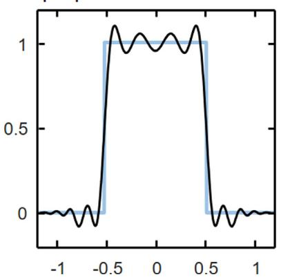

**Fig. 5.** The rectangle function can be approximated by the sum of Gaussians, which simplifies the estimation of the
integral in Eq. (11).

of Gaussians with complex coefficients (Fig. 5):

$$\\Pi\\left(\\frac{y'}{h}\\right) \\approx \\sum\_{g=1}^{G} A_g e^{-B_g\\left(\\frac{y'}{h}\\right)^2}.$$ (12)

Eq. (11) thus becomes

$$\\int\_{-\\infty}^{+\\infty} \\Pi\\left(\\frac{y'}{h}\\right) e^{-ik\\frac{y'^2}{2R_f}} e^{ik\\frac{(y-y')^2}{2r}} dy'
\\approx \\sum\_{g=1}^G A_g \\int\_{-\\infty}^{+\\infty} e^{-\\alpha_g y'^2 + \\beta y' + \\gamma} dy', \\quad (13)$$

where

$$\\alpha_g = \\frac{B_g}{h^2} + \\frac{ik}{2} \\left( \\frac{1}{R_f} - \\frac{1}{r} \\right), \\quad \\beta =
\\frac{-iky}{r}, \\quad \\gamma = \\frac{iky^2}{2r}. \\tag{14}$$

Solving the right-hand side Gaussian integral5 in Eq. (13) yields

$$\\int\_{-\\infty}^{+\\infty} \\Pi\\left(\\frac{y'}{h}\\right) e^{-ik\\frac{y'^2}{2R_f}} e^{ik\\frac{(y-y')^2}{2r}} dy'
\\approx \\sum\_{g=1}^G A_g \\sqrt{\\frac{\\pi}{\\alpha_g}} e^{\\frac{\\beta^2}{4\\alpha_g} + \\gamma}. \\tag{15}$$

From Eq. (15), the second integral of Eq. (9) thus reduces to

(9) $$\\int\_{-h/2}^{h/2} e^{-ik\\frac{y'^2}{2R_f}} e^{ik\\frac{(y-y')^2}{2r}} dy' \\approx \\sum\_{g=1}^{G} A_g
\\sqrt{\\frac{\\pi}{\\alpha_g}} e^{\\frac{\\beta^2}{4\\alpha_g} + \\gamma}.$$ (16)

Replacing the two integrals in (9) by their respective expressions (10) and (16) provides an estimate of the acoustic
pressure generated by a single element:

$$P(\\mathbf{x}, \\omega, t) \\approx \\underbrace{\\left{\\frac{kb}{i\\pi}\\rho
c\\nu\_{0}(\\omega)\\right}}_{P_{\\text{Tx}}(\\omega)} \\underbrace{e^{ikr}}_{r} e^{-i\\omega t} \\times
\\underbrace{\\sin(kb\\sin\\theta)}_{D(\\theta,k)} \\underbrace{\\left{\\sum\_{g=1}^{G} A\_{g}
\\sqrt{\\frac{\\pi}{\\alpha\_{g}}} e^{\\frac{\\beta^{2}}{4\\alpha\_{g}} + \\gamma}\\right}}\_{\\delta(y,r,k)}.$$

$$(17)$$

The coefficients $A_g$ and $B_g$ were determined by minimizing the $\\ell_2$ norm of the difference (rectangle – sum of
Gaussians, Fig. 5) in

&lt;sup>3 https://www.wolframalpha.com/input/?i=int+exp%28-i\*k\*S\*x%29+from+x+%3D+-b+to+b.

&lt;sup>4
https://www.wolframalpha.com/input/?i=int+exp%28-i\*%28P\*Y%5E2%2BQ\*Y%2BR%29%29+from+Y+%3D+-h%2F2+to+h%2F2.

&lt;sup>5 https://mathworld.wolfram.com/GaussianIntegral.html.

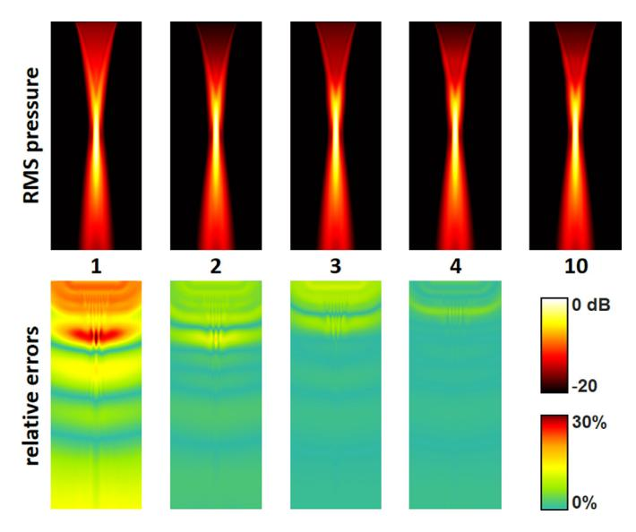

**Fig. 6.** Effects of the number of Gaussians in the Gaussian superposition model. Top row: focused pressure fields
simulated with PFIELD for a 64-element 2.7-MHz cardiac phased array (see Fig. 9). The middle line indicates the number
of Gaussians. Bottom row: relative errors with respect to the pressure field obtained with 10 Gaussians.

the interval [-2, 2]. To ensure that the sum of the complex Gaussians is real, the coefficients are the complex
conjugates of the others. By default, PFIELD uses four coefficients:

$$A_1 = 0.187 + 0.275i, B_1 = 4.558 - 25.59i,$$

$A_2 = 0.288 - 1.954i, B_2 = 8.598 - 7.924i,$ $A_3 = \\overline{A_1}, B_3 = \\overline{B_1},$ $A_4 = \\overline{A_2},
B_4 = \\overline{B_2}.$ (18)

More coefficients can be used to obtain more numerical accuracy (at the expense of computing time). Lists with up to 25
coefficients are provided in [23,33]. It should be noted, however, that obtaining realistic ultrasound images does not
require very fine numerical precision. By way of example, Fig. 6 shows the effects of the number of Gaussians on focused
pressure fields generated by a cardiac phased array. Four Gaussians led to small differences compared with ten
Gaussians.

In practice, it is not the velocity of the element that is known, but the acoustic pressure generated by an element,
measured for example with a hydrophone. The first term in brackets (dimensionally homogeneous to pressure) in the
expression (17) represents the spectrum of the transmit pressure pulse (up to a constant multiplier), noted $P\_{\\rm
Tx}(\\omega)$ . The sine cardinal sinc term represents the x-directivity of one element, noted $D(\\theta, k)$ . The
last term in brackets is related to the elevation focusing. It is homogeneous to a distance and is noted $\\delta(y, r,
k)$ . Using these notations, the acoustic pressure of one element finally reduces to

$$P(\\mathbf{x}, \\omega, t) \\approx P\_{\\text{Ix}}(\\omega) \\frac{e^{ikr}}{r} D(\\theta, k) \\delta(y, r, k)
e^{-i\\omega t}.$$ (19)

More generally, if the transmission is delayed by $\\Delta \\tau$ , the wave field is given by

$$P(\\mathbf{x}, \\omega, t) \\approx P\_{\\text{Tx}}(\\omega) \\frac{e^{ikr}}{r} D(\\theta, k) \\delta(y, r, k) \\
e^{i\\omega\\Delta\\tau} e^{-i\\omega t}. \\tag{20}$$

It is recalled that the position variables ( $\\mathbf{x}$ , $\\theta$ , r) in (20) are relative to the center of the
element (Fig. 3).

## 2.3. Acoustic field of a rectilinear array

The expression (20) models acoustic waves radiated by one element. To derive this expression, the distance r with
respect to the element [see Eq. (6)] was simplified by using a Fraunhofer (farfield) approximation in the azimuthal
x-direction, and a Fresnel (paraxial) approximation in the elevation y-direction. In order to fulfill the far-field
condition, it may be necessary to split the array elements into $\\nu$ sub-elements, in the azimuthal x-direction, if
they are too wide (Fig. 7). Radiation patterns that result from splitting are given in Appendix C for element
transducers of different widths. In PFIELD, $\\nu$ is chosen so that a sub-element width (= $2b/\\nu$ ) is not greater
than the minimal wavelength (defined at -6 dB):

$$\\nu = \\left\\lceil \\frac{2b}{\\lambda\_{\\min}} \\right\\rceil,\\tag{21}$$

where $\\lceil \\rceil$ is the ceiling function. As an indication, the number $\\nu$ of simulated sub-element(s) per
array element is typically 1 for cardiac phased arrays, and 2 for linear arrays. If an array contains N elements, the
total number of sub-elements is thus $(\\nu N)$ . Given the properties of linearity, the acoustic wavefield produced by
an N-element array can be modeled by superimposing the $(\\nu N)$ individual sub-element models described by (20):

$$P(\\mathbf{X}, \\omega, t) \\approx P\_{\\mathsf{TX}}(\\omega) e^{-i\\omega t} \\times \\sum\_{n=1}^{\\nu N} W_n
\\frac{e^{ikr_n}}{r_n} D(\\theta_n, k) \\delta(y_n, r_n, k) e^{i\\omega \\Delta \\tau_n}.$$ (22)

In (22), the position variables $(\\theta_n, y_n, r_n)$ are relative to the center of the $n^{\\text{th}}$ sub-element.
The position X = (X, Y, Z) is relative to the coordinate system of the array depicted in Fig. 2. If $X\_{c,n}$ stands
for the abscissa of the $n^{\\text{th}}$ sub-element centroid, then

$$r_n = \\sqrt{(X - X\_{c,n})^2 + Y^2 + Z^2}$$ , and $\\sin \\theta_n = (X - X\_{c,n}) / \\sqrt{(X - X\_{c,n})^2 + Z^2}$
. (23)

We here used $Z\_{C,n}=0$ since we only address rectilinear arrays in this paper. Let the leftmost to rightmost
sub-elements be numbered sequentially, from 1 to n. In the case of a uniform linear array of pitch p (Fig. 7), it can be
shown that its centroid abscissa can be written as

$$X\_{c,n} = \\frac{p}{2} \\left( 2 \\left\\lceil \\frac{n}{\\nu} \\right\\rceil - N - 1 \\right) + \\frac{b}{\\nu}
\\left( 2(n-1) \\pmod{\\nu} - \\nu + 1 \\right)$$ (24)

The term $\\lceil \\frac{n}{\\nu} \\rceil$ corresponds to the number of the element to which the sub-element n belongs.
Note that $X\_{C,n}$ (and $Z\_{C,n} \\neq 0$ ) must be modified for a convex array (see the PFIELD code for details).
The transmit delay $\\Delta \\tau_n = \\Delta \\tau\_{\\lceil n/\\nu \\rceil}$ in (22) is that of the $\\lceil n/\\nu
\\rceil^{\\text{th}}$ element. Each element has been weighted by $W_n = W\_{\\lceil n/\\nu \\rceil}$ to consider
transmit apodization. The Eq. (22) is the backbone of PFIELD. Once the transmit pressure $P\_{\\text{Tx}}(\\omega)$ is
given in the frequency domain, it allows simulation of realistic fields of acoustic pressure produced by an ultrasound
array. In PFIELD, the transmit pressure is generated by convolving the one-way response of the transducer with a
windowed sine, as explained in the next section. An advanced user can define her own $P\_{\\text{Tx}}(\\omega)$
spectrum, derived from experimental measurements for example. From the acoustic reciprocity principle, Eq. (22) can also
be applied to derive the backscattered echoes, as will be explained in section IV.

## 3. Spectrum of the transmit pressure

The general expression (22) contains the spectrum of the transmit pressure $P\_{\\text{Tx}}(\\omega)$ . An advanced user
can easily include the spectrum of his/her choice in the code. In SIMUS and PFIELD, the

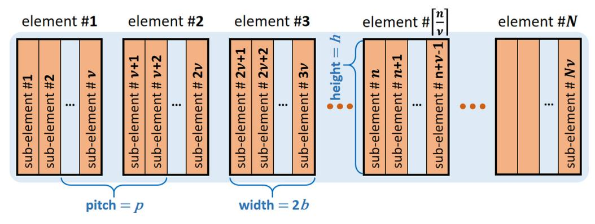

Fig. 7. To ensure that the far-field condition is met, the N array elements are each divided into $\\nu$ sub-elements.

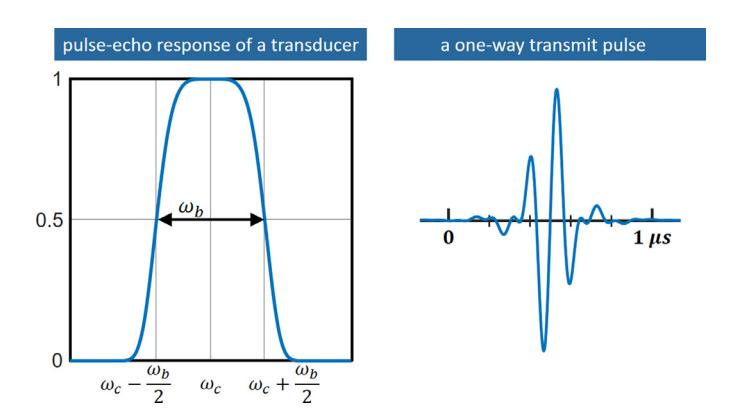

**Fig. 8.** Left – Pulse-echo response of the transducer. $\\omega_c$ is the center angular frequency ( $\\omega_c =
2\\pi f_c$ ). $\\omega_b$ is the angular frequency bandwidth. Right – Example of a one-way transmit pulse (center
frequency = 7.6 MHz, fractional bandwidth = 77%, excitation pulse = 1 wavelength).

default transmit pressure waveform is obtained by convolving a rectangularly-windowed sinusoid (a "perfect" pulse) with
the point spread function (PSF) of the transducer. The angular frequency of the sinusoid is that of the transducer (
$\\omega_c = 2\\pi f_c$ , the center frequency $f_c$ being provided by the manufacturer). The temporal width T of the
rectangular window is defined in terms of the number of wavelengths $n\_\\lambda$ by $T = n\_\\lambda | f_c = 2\\pi
n\_\\lambda / \\omega_c$ . The spectrum of the rectangularly-windowed pulse is given by

$$S\_{P}(\\omega) = i \\left\[ \\operatorname{sinc} \\left( T , \\frac{\\omega - \\omega\_{c}}{2} \\right) -
\\operatorname{sinc} \\left( T , \\frac{\\omega + \\omega\_{c}}{2} \\right) \\right\] \\tag{25}$$

The spectrum of the transducer PSF is defined by a generalized Gaussian window that depends on two positive parameters p
and $\\sigma$ :

$$S\_{\\mathrm{T}}(\\omega) = e^{-\\left(\\frac{|\\omega - \\omega\_{\\mathrm{c}}|}{\\sigma
\\omega\_{\\mathrm{c}}}\\right)^{p}} \\tag{26}$$

It is designed so that its pulse-echo response has a given bandwidth $\\omega_b$ at -6 dB (Fig. 8). The pulse-echo
fractional bandwidth is generally given by the manufacturer in percent. For example, a 65% bandwidth means that the
frequency bandwidth of the response is such that $\\omega_b = 0.65~\\omega_c$ . To determine both p and $\\sigma$ , it
is postulated that $\\mathcal{S}\_{\\rm T}(0) = 2^{-126}$ (the smallest positive single-precision floating-point number;
PFIELD and SIMUS work in single precision). It follows that (see Appendix)

$$S\_{T}(\\omega) = e^{-\\ln 2\\left(\\frac{2 |\\omega - \\omega\_{c}|}{\\omega\_{b}}\\right)^{p}}, \\text{ with } p =
\\ln 126 / \\ln\\left(2\\frac{\\omega\_{c}}{\\omega\_{b}}\\right). \\tag{27}$$

Fig. 8 (left panel) depicts an example of the simulated transducer response for a pulse-echo fractional bandwidth of
77%. PFIELD does not include the electrical-acoustic conversions that oc-

cur in the piezoelectric elements. The units of the simulated acoustic and electrical signals are thus arbitrary (not Pa
or V). By using this simplified representation and writing the convolution in the frequency domain, the spectrum of the
transmit pressure $P\_{\\text{Tx}}(\\omega)$ is given by this proportionality relationship:

$$P\_{\\text{Tx}}(\\omega) \\propto S\_{\\text{P}}(\\omega) \\sqrt{S\_{\\text{T}}(\\omega)}$$ (28)

A square root is needed since the transducer response $\\mathcal{S}\_T(\\omega)$ is two-way (transmit + receive). Fig. 8
(right panel) presents a transmit pulse (one-way) in the temporal domain.

#### 4. SIMUS inside out

#### 4.1. Echoes received by a sub-element

SIMUS uses PFIELD and point-like scatterers to simulate radiofrequency (RF) ultrasound signals. These scatterers become
individual monopole point sources when an incident wave reaches them. They do not acoustically interact with each other
according to the assumption of single weak scattering. Each scatterer is defined by its reflection coefficient (
$\\mathcal{R}\_s$ ), which describes how much amplitude of a wave is reflected. Although some tissues, such as blood,
are governed by Rayleigh scattering [34], the $\\mathcal{R}\_s$ coefficients are assumed constant, i.e. independent of
frequency and incidence angle. From (22), the pressure signal received by a scatterer #s located at $\\mathbf{X}\_s =
(X_s, Y_s, Z_s)$ is

$$P(\\mathbf{X}_{s}, \\omega, t) \\approx P_{\\text{Tx}}(\\omega) e^{-i\\omega t} \\times \\sum\_{n=1}^{\\nu N} W\_{n}
\\frac{e^{ikr\_{ns}}}{r\_{ns}} D(\\theta\_{ns}, k) \\delta(Y\_{s}, r\_{ns}, k) e^{i\\omega \\Delta \\tau\_{n}}, \\qquad
(29)$$

where $r\_{ns} = \\sqrt{(X_s - X\_{c,n})^2 + Y_s^2 + Z_s^2}$ and $\\sin \\theta\_{ns} = (X_s - X\_{c,n})/\\sqrt{(X_s -
X\_{c,n})^2 + Z_s^2}$ . The principle of acoustic reciprocity dictates that an acoustic response remains identical when
the source and receiver are exchanged. Expression (19) can therefore give the pressure received by the $m^{\\text{th}}$
sub-element from a scatterer s, after accounting for its reflection coefficient $\\mathcal{R}\_s$ :

$$P^{\\text{se}}_{ms}(\\omega, t) \\approx \\mathcal{R}_{s} \\underbrace{P(\\mathbf{X}_{s}, \\omega,
t)}_{P(\\mathbf{X}_{s}, \\omega) e^{-i\\omega t}} \\underbrace{\\frac{e^{ikr_{ms}}}{r\_{ms}}}_{P(ms)} D(\\theta_{ms}, k)
\\delta(Y\_{s}, r\_{ms}, k), \\tag{30}$$

where $r\_{ms} = \\sqrt{(X_s - X\_{c,m})^2 + Y_s^2 + Z_s^2}$ and $\\sin \\theta\_{ms} = (X_s - X\_{c,m})/\\sqrt{(X_s -
X\_{c,m})^2 + Z_s^2}$ . In (30), the superscript "se" means "sub-element". Inserting (29) in (30), it follows that:

 $$P^{\\text{se}}_{ms}(\\omega, t) \\approx \\mathcal{R}_{s} P\_{\\text{TX}}(\\omega)
e^{-i\\omega t}$$

$$\\times \\left\[ \\sum\_{n=1}^{\\nu N} W\_{n} \\frac{e^{ikr\_{ns}}}{r\_{ns}} D(\\theta\_{ns}, k) \\delta(Y\_{s},
r\_{ns}, k) e^{i\\omega \\Delta \\tau\_{n}} \\right\]$$

$$\\times \\frac{e^{ikr\_{ms}}}{r\_{ms}} D(\\theta\_{ms}, k) \\delta(Y\_{s}, r\_{ms}, k). \\tag{31}$$

The expression (31) is the acoustic pressure backscattered by a single scatterer and received by the $m^{\\rm th}$
sub-element. Assuming now that there is a total of S scatterers, the combination of their independent effect (single
scattering assumption) gives the total pressure received by the $m^{\\rm th}$ sub-element:

$$P^{\\text{se}}_{m}(\\omega, t) \\approx P_{\\text{Tx}}(\\omega)e^{-i\\omega t}$$

$$\\times \\sum\_{s=1}^{S} \\left{ \\mathcal{R}_{s} \\left\[ \\sum_{n=1}^{\\nu N} W\_{n} \\frac{e^{ikr\_{ns}}}{r\_{ns}}
D(\\theta\_{ns}, k) \\delta(Y\_{s}, r\_{ns}, k) e^{i\\omega \\Delta \\tau\_{n}} \\right\] \\right.$$

$$\\times \\frac{e^{ikr\_{ms}}}{r\_{ms}} D(\\theta\_{ms}, k) \\delta(Y\_{s}, r\_{ms}, k) \\right}. \\tag{32}$$

The expression (32) is for an individual sub-element #m. The pressure wave $P^{e}(\\omega,t)$ received by one transducer
element is the coherent sum of the pressures received by all its sub-elements (Fig. 7). For the element $#\\lceil
\\frac{n}{n} \\rceil$ :

$$P^{e}_{\\lceil \\frac{n}{v} \\rceil}(\\omega, t) = \\sum_{\\mu=0}^{\\nu-1} P^{se}\_{n+\\mu}(\\omega, t)$$ (33)

The theoretical pressures were all derived for a single angular frequency $\\omega=2\\pi f$ . The full-band waveforms
can be obtained by summation in the frequency domain through an inverse fast Fourier transform.

# 4.2. Radiofrequency signals

The spectrum of the radiofrequency RF signal of the $m^{th}$ sub-element is related to the received acoustic pressure
(32) by

$$RF^{se}_{m}(\\omega, t) \\propto \\sqrt{S_{T}(\\omega)} P^{se}\_{m}(\\omega, t),$$ (34)

where it is recalled that $\\sqrt{S\_{\\rm T}(\\omega)}$ is the one-way transducer response. Alike (33), the RF signal
related to one element is the coherent sum of the RF signals of its sub-elements.

## 5. The 2-D case

PFIELD and SIMUS can also work in two dimensions to speed up calculations, for example, when rapid testing is required.
In a two-dimensional (2-D) x-z domain, the piston-like element generates a normal velocity that is constant everywhere
(i.e. in $[-\\infty, +\\infty]$ ) in the y-direction. This situation is obtained when h (element height) and $R_f$
(distance to elevation focus) both tend to $+\\infty$ . In this limit case, the rectangular function in Eq. (12) becomes
1 for any y', and the coefficients reduce to G=1, with $A_1=1$ and $B_1=0$ . Under these conditions,
$\\beta^2/(4\\alpha_1)+\\gamma=0$ and $\\sqrt{(\\pi/\\alpha_1)}=\\sqrt{(2i\\pi r/k)}$ [see Eq. (14) and (15)]. In 2-D,
from (17), the acoustic pressure generated by a single element thus reads

$$P\_{2D}(\\mathbf{x},\\omega,t) \\approx \\left{ \\frac{kb}{i\\pi} \\rho c v_0(\\omega) \\right} \\frac{e^{ikr}}{r}
e^{-i\\omega t} \\operatorname{sinc}(kb \\sin \\theta) \\sqrt{\\frac{2i\\pi r}{k}}, \\quad (35)$$

which can be rewritten as

$$P\_{2D}(\\mathbf{x},\\omega,t) \\approx \\sqrt{2b} \\underbrace{\\left{ \\sqrt{\\frac{kb}{i\\pi}} \\rho c v_0(\\omega)
\\right}}_{P_{\\omega}(\\omega)} \\underbrace{\\frac{e^{ikr}}{\\sqrt{r}} e^{-i\\omega t}
\\underbrace{\\operatorname{sinc}(kb \\sin \\theta)}\_{D(\\theta,k)}. \\tag{36}$$

The acoustic wave (22) radiated by an N-element array then becomes

$$P\_{2D}(\\boldsymbol{X},\\omega,t) \\approx \\sqrt{2b} P\_{TX}(\\omega) e^{-i\\omega t} \\sum\_{n=1}^{\\nu N} W_n
\\frac{e^{ikr_n}}{\\sqrt{r_n}} D(\\theta_n,k) e^{i\\omega \\Delta \\tau_n}.$$ (37)

Similarly, the pressure received by the $m^{\\rm th}$ sub-element (32) in a 2-D space reduces to

$$P\_{2Dm}^{\\text{se}}(\\omega,t) \\approx (2b) P\_{\\text{Tx}}(\\omega) e^{-i\\omega t}$$

$$\\times \\sum\_{s=1}^{S} \\left{ \\mathcal{R}_{s} \\left\[ \\sum_{n=1}^{\\nu N} W\_{n}
\\frac{e^{ikr\_{ns}}}{\\sqrt{r\_{ns}}} D(\\theta\_{ns},k) e^{i\\omega \\Delta \\tau\_{n}} \\right\]$$

$$\\times \\frac{e^{ikr\_{ms}}}{\\sqrt{r\_{ms}}} D(\\theta\_{ms},k) \\right}.$$ (38)

# 6. Baffle impedance and dispersive medium

#### 6.1. Finite impedance baffle

The general expressions (22) and (32) were derived by assuming that the baffle in which the transducer element is
embedded has an infinite acoustic impedance (rigid baffle). It might be recommended to use a finite baffle impedance to
obtain more realistic radiation patterns [21,22]. In such a case, an obliquity factor must be added to the element
directivity $D(\\theta, k)$ [see Eq. (36)]. The expressions of the obliquity factors for a nonnegative finite impedance
are given in [21] (null impedance = "soft" baffle) and [22] (positive impedance). The element directivity becomes

rigid: $$D(\\theta, k) = \\operatorname{sinc}(kb\\sin\\theta)$$ . soft: $D(\\theta, k) =
\\operatorname{sinc}(kb\\sin\\theta)\\cos\\theta$ . otherwise: $D(\\theta, k) =
\\operatorname{sinc}(kb\\sin\\theta)\\frac{\\cos\\theta}{\\cos\\theta + \\zeta}$ , (39)

with $\\zeta$ standing for the ratio between the medium and baffle impedances. For a baffle of impedance 2.8 MRayl
(epoxy) adjacent to soft tissues of impedance 1.6 MRayl, $\\zeta = 1.75$ [22]. By default, the baffle is soft in PFIELD
and SIMUS.

## 6.2. Attenuation

In addition to the distance-dependent decrease in amplitude caused by the inverse law (or inverse square-root law in
2-D), an ultrasound wave propagating in tissues is attenuated through scattering and absorption. In SIMUS, scattering is
governed by the reflectivity coefficients $\\mathcal{R}\_s$ . In the current version of the proposed ultrasound
simulator, the medium is assumed non-dispersive, which means that waves of different wavelengths travel at the same
phase velocity (= c). In PFIELD and SIMUS, absorption can be included in the amplitude by adding a frequency-dependent
multiplicative loss term. For numerical reasons (a recursive multiplication is used to calculate the exponential terms),
this frequency dependence is linear in the current version of PFIELD. Amplitude absorption is obtained by substituting
$e^{i(k+ik_a)r}$ for $e^{ikr}$ , where $(k_a)$ is given by:

$$k_a = \\frac{\\alpha\_{\\rm dB}}{8.69} \\frac{kc}{2\\pi \\cdot 10^4}.$$ (40)

The attenuation coefficient $\\alpha\_{dB}$ is in dB/cm/MHz. A typical value for soft tissues is 0.5 dB/cm/MHz [36]. The
$10^4$ accounts for the unit conversion (cm·MHz to m·Hz). The scalar 8.69 is an approximation of $20/\\ln(10)$ (see Eq
4.4 in [37]).

# 7. RMS pressure fields

Eq. (22) gives the acoustic pressure field for a given angular frequency $\\omega$ . This is the expression used by the
SIMUS code when it calls PFIELD. When used alone, the PFIELD MATLAB code returns, by default, the root-mean-square RMS
pressure field. If we omit the $(e^{-i\\omega t})$ term in (22) and define $P(X, \\omega)$ by the relationship $P(X,
\\omega, t) \\equiv P(X, \\omega)e^{-i\\omega t}$ , the RMS pressure field is given by

$$P\_{\\text{RMS}}(\\boldsymbol{X}) = \\sqrt{\\int\_{0}^{2\\omega\_{c}} P(\\boldsymbol{X}, \\omega)^{2} d\\omega}.$$
(41)

The integral can be estimated by using a midpoint Riemann sum with $N_f$ equally spaced frequency samples:

$$P\_{\\text{RMS}}(\\boldsymbol{X}) \\approx \\sqrt{\\Delta \\omega \\sum\_{j=0}^{N_f} P\\left(\\boldsymbol{X},
2\\left(\\frac{j}{N_f}\\right) \\omega_c\\right)^2}.$$ (42)

The partition width $\\Delta\\omega$ must be small enough to ensure a proper approximation, but not too small to avoid
computational overload with a large $N_f$ . The angular frequency step is chosen so that the phase increment in (20) be
smaller than $2\\pi$ everywhere in the radiated region of interest (roi), i.e. $\\Delta\\omega$ must verify
$[(\\Delta\\omega/c)r + \\Delta\\omega\\Delta\\tau] < 2\\pi$ for any distance r and transmit delay $\\Delta\\tau$ , i.e.
$\\Delta\\omega = \\min\_{r \\in \\Gamma} {2\\pi/(r/c + \\Delta\\tau)}$ .

Once the transmit delays $\\Delta \\tau_n$ and the parameters of the array are given, the Eqs. (22) and (42) yield the
RMS pressure field at the location specified by X, Fig. 9 and Fig. 10 illustrate two examples of acoustic fields
simulated with PFIELD: focused and plane wavefronts with a cardiac and linear array, respectively. In these examples,
the 3-D equation was applied to take the elevation focusing into account.

#### 8. Medical ultrasound images with SIMUS

Medical ultrasound images, such as B-mode or color Doppler images, can be generated by simulating RF signals through Eq.
(32). Once RF signals are obtained, they can be post-processed (e.g. using I/Q demodulation, beamforming, clutter
filtering, phase analysis, envelope detection...) by using the MATLAB codes available in the MUST toolbox.6 A
series of RF signals given by SIMUS in a simplified configuration (a focused wave that radiates five scatterers) is
displayed in Fig. 11. Realistic ultrasound images can be obtained when using a large number of point-like scatterers, as
explained in the next paragraphs.

## 8.1. B-mode imaging

Fig. 12 illustrates the simulation of a long-axis echocardiographic image (three-chamber view) by scanning the left
heart with a series of focused waves. The synthetic myocardial tissue contained 39,500 randomly distributed point
scatterers (density = 10 scatterers per wavelength squared) whose reflection coefficients are shown in Fig. 12. The
fan-shaped B-mode image consists of 128 scanlines. Each scanline was constructed from one tilted focused wave generated
by a 2.7-MHz phased array (64 elements, 0.3-mm pitch, 74% fractional bandwidth, 6-cm elevation focus). RF signals were
simulated with SIMUS, then I/Q demodulated and beamformed using a delay-and-sum with an optimal f-number [38]. The
B-mode image was obtained by log-compressing the real envelopes.

# 8.2. Color flow imaging and vector flow imaging

SIMUS (and the tools available in the MUST toolbox [27]) can also be used to simulate realistic color flow images (color
Doppler)

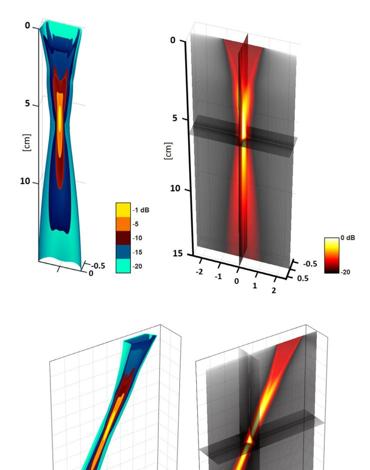

**Fig. 9.** Focused pressure fields simulated with PFIELD for a 64-element 2.7-MHz P4–2v cardiac phased array (kerf
width = 50 $\\mu$ m, pitch = 0.3 mm, fractional bandwidth = 74%, elevation focus = 6 cm). These RMS (root mean square)
acoustic fields illustrate emission sequences such as those used in standard transthoracic echocardiography, with
focusing in the axial direction.

and vector flow images. Two-dimensional simulations of color and vector Doppler in a 2-D carotid bifurcation were
introduced in a previous work that combined CFD (computational fluid dynamics) by SPH (smooth particle hydrodynamics)
with SIMUS [26]. In that paper, radiofrequency RF signals were simulated by SIMUS using a plane-wave-imaging sequence
(non-tilted waves transmitted by a 128-element linear array). After I/Q demodulation and beamforming with two distinct
subapertures (see details in [26]), a one-lag slow-time autocorrelator was applied to recover 2-D velocity fields. The
two beamforming subapertures provide two Doppler images with significantly different angles, which makes it possible to
derive 2-D velocity vectors. This approach has been applied successfully in vivo with sub-Nyquist RF sampling [39] and
can be generalized with more than two subapertures [40]. Fig. 13 provides two snapshots adapted from [26].

## 9. Comparison with other software & Discussion

Comparisons against other software packages, as well as advantages and limitations of SIMUS, are discussed in the
accompanying article (part II).

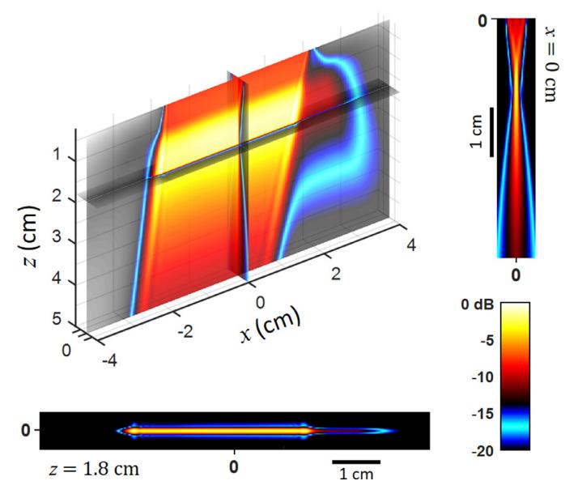

**Fig. 10.** Plane-wave pressure field simulated with PFIELD for a 128-element 7.6- MHz L11–5v linear array (kerf width
= 30 μm, pitch = 0.27 mm, fractional bandwidth = 77%, elevation focus = 1.8 cm). This RMS (root mean square) acoustic
field illustrates an emission sequence (here, tilt angle = 10°) such as that used in "ultrafast" compound plane-wave
imaging, without focusing in the axial direction [[35].](#page-10-0) The two insets represent focal and elevational
planes.

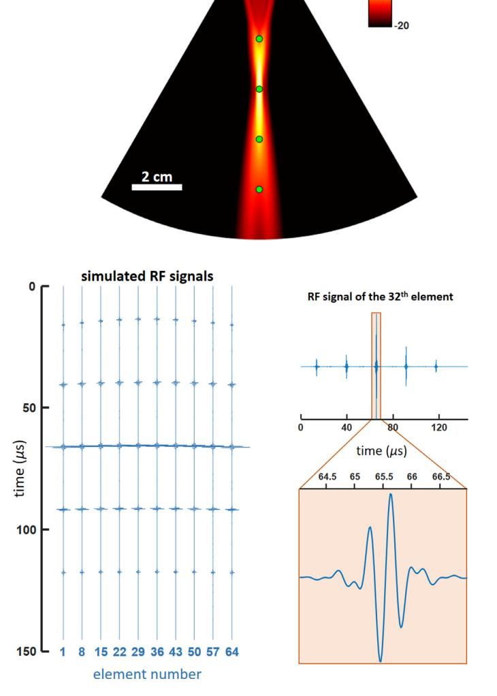

**Fig. 11.** RF signals simulated with SIMUS for a P4–2v phased array transmitting a focused wave in a medium that
contains five scatterers.

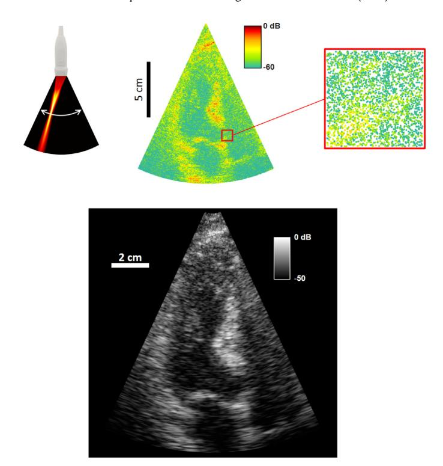

**Fig. 12.** Simulation of a three-chamber-view echocardiographic image. RF signals were simulated with SIMUS by using
39,500 scatterers with predefined reflection coefficients (top row). 128 focused waves were transmitted to create the
128 scanlines of the B-mode image.

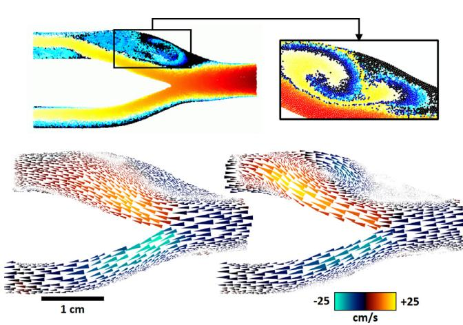

**Fig. 13.** Simulation of color Doppler and vector Doppler in a 2-D carotid bifurcation. The displacements of ∼26,000
blood scatterers (top row) were simulated by SPH (smoothed particle hydrodynamics), a Lagrangian CFD method
[[26].](#page-10-0) The inset is at another time. RF signals were simulated with SIMUS by using unsteered plane waves.
Color Doppler (bottom row, red-blue patterns) and vector Doppler (bottom row, arrows) were generated by post-processing
the I/Q signals (beamforming, autocorrelator, robust smoothing) with tools available in the MUST toolbox. Adapted from
[[26].](#page-10-0)

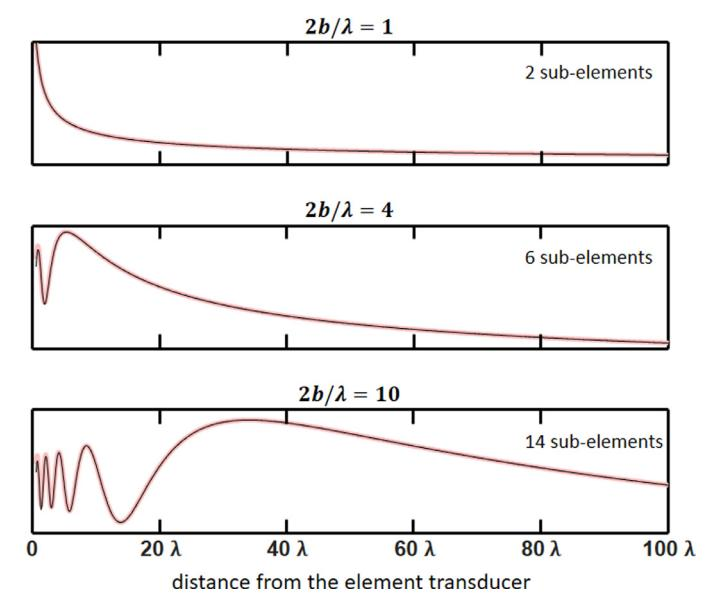

**Fig. 14.** Comparison of on-axis pressure magnitudes (arbitrary units) generated by one element transducer at the
center frequency (2-D acoustics): element splitting + far-field (thin black lines) vs. Rayleigh-Sommerfeld integral
(thick pink lines). The number of sub-elements was given by Eq. (21). The width of the element is 2b.

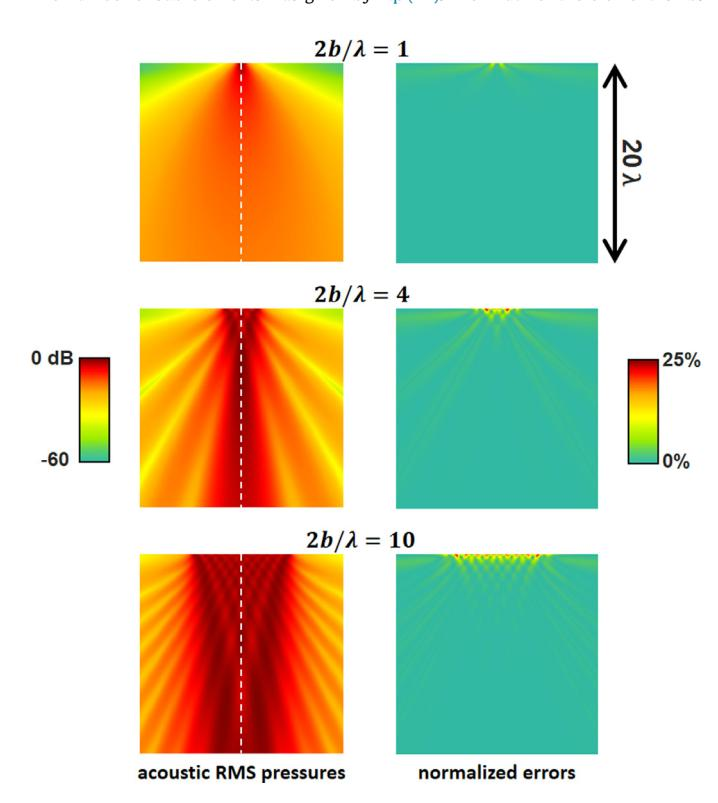

**Fig. 15.** SIMUS-derived radiation patterns (RMS pressures) generated by one element transducer at the center
frequency with 2-D acoustics (1st column). The normalized errors (2nd column) are with respect to the
Rayleigh-Sommerfeld integral. The patterns along the white dashed lines are in Fig. 14. The width of the element is 2b.

## 10. Conclusion

The assumptions and simplifications included in PFIELD and SIMUS make its theory and numerical time-harmonic analysis
convenient. The examples show that realistic ultrasound images can be created for educational and research purposes. How
PFIELD compares to Field II, k-Wave, FOCUS, and Verasonics is detailed in

the accompanying article (part II). The current version of PFIELD (2021), although it includes the 3-D acoustic equation
for elevation focusing, is limited to one-dimensional, linear, or convex ultrasonic transducers. A volume version is
planned. Nevertheless, based on the far-field equations described in this paper, and keeping similar hypotheses, an
advanced user could adapt SIMUS for the simulation of matrix arrays and volumetric acoustic fields.

#### Acknowledgment

I thank my former students from Montreal and Lyon who tested and re-tested the different versions and contributed to the
improvement of the MUST toolbox. In particular: Jonathan Porée, Daniel Posada, Julia Faurie, Craig Madiena, Vincent
Perrot. As well as my colleagues from CREATIS, Lyon, Olivier Bernard, and François Varray for making the most of MUST.
This work was supported in part by the LABEX CeLyA (ANR-10-LABX-0060) of Université de Lyon, within the program
"Investissements d'Avenir" (ANR-16-IDEX-0005) operated by the French National Research Agency.

#### **Appendix**

Paraxial and far-field distances

Eq. (2) can be rewritten as

$$r' = z \\sqrt{\\left[1 + \\frac{(x - x')^2}{z^2}\\right] + \\frac{(y - y')^2}{z^2}}.$$ (43)

In the paraxial (Fresnel) approximation, $(y-y')^2/z^2 \\ll [1+(x-x')^2/z^2]$ . One can thus write7

$$r' \\approx \\sqrt{z^2 + (x - x')^2} + \\frac{(y - y')^2}{2\\sqrt{z^2 + (x - x')^2}}.$$ (44)

In the paraxial approximation, one has also $r^2 \\approx x^2 + z^2$ . The expression (44) can thus be approximated by

$$r' \\approx r\\sqrt{1 + \\frac{{x'}^2}{r^2} - 2\\frac{xx'}{r^2}} + \\frac{\\left(y - y'\\right)^2}{2r\\sqrt{1 +
\\frac{{x'}^2}{r^2} - 2\\frac{xx'}{r^2}}}.$$ (45)

By keeping the first order of x' in the first square root and the 0th order in the second (far-field approximation), we
obtain

$$r' \\approx r \\left( 1 - \\frac{xx'}{r^2} \\right) + \\frac{\\left( y - y' \\right)^2}{2r}. \\tag{46}$$

Because $\\sin \\theta = x/\\sqrt{x^2 + z^2} \\approx x/r$ (Fig. 3), (46) reduces to Eq. (6).

Spectrum of the transducer PSF

We need a $\\omega_b$ bandwidth at -6 dB. Therefore, from (26):

$$S\_{t}\\left(\\omega\_{c} \\pm \\frac{\\omega\_{b}}{2}\\right) =
e^{-\\left(\\frac{\\omega\_{b}}{2\\sigma\\omega\_{c}}\\right)^{p}} = \\frac{1}{2}$$ (47)

One can thus deduce $\\sigma$ :

$$\\sigma = \\frac{1}{p\\sqrt{\\ln 2}} \\frac{\\omega_b}{2\\omega_c} \\tag{48}$$

By assuming that

$$S_t(0) = S_t(2\\omega_c) = e^{-\\frac{1}{\\sigma^p}} = 2^{-126},$$ (49)

the expressions (48) and (49) yield p [Eq. (27)].

&lt;sup>7 $\\sqrt{a+x} = \\sqrt{a} + x/(2\\sqrt{a}) + O(x^2)$ https://www.egr.msu.edu/~fultras-web.

#### *Element splitting and far-field equations*

In MUST, the transducer elements are partitioned to enable the use of far-field equations [Fig.](#page-5-0) 7). The
far-field approximation is valid if 2*xx* /*r*2 1 \[see Eq. [(45)](#page-9-0) and [(46)\]](#page-9-0). After
partitioning, *x* can be as large as *b*/*M* (*M* being the number of partitions per element), and *x* can be as large
as *r*. The inequality thus becomes (2*b*/*M*)/*r* 1, which means that the width of a sub-element must be sufficiently
small compared to the distance to the point of interest. In PFIELD, we choose the default condition λ/*r* 1 so that the
number of partitions per element is determined by Eq. [(21).](#page-4-0) [Fig.](#page-9-0) 14 compares on-axis pressures
(using 2-D acoustics) as calculated with element splitting \[Eq. [(37)\]](#page-6-0) and far-field equations against
those derived from the Rayleigh-Sommerfeld integral \[Eq. (2.46) in [25]\].

[Fig.](#page-9-0) 15 displays the radiation patterns generated by SIMUS and provides the normalized errors with respect
to the Rayleigh-Sommerfeld integral. It can be seen that element splitting enables accurate pressure estimates even at
small distances from the transducer. Note that the number of partitions can be optionally adjusted by the user to refine
the results near the element transducer. This may however have a limited impact due to round-off errors related to the
1/*r* term in the equations. Specially adapted software such as FOCUS8 removes this singularity, allowing
high accuracy to be achieved in the near-field region [41].

#### **References**

- [1] J. Porée, D. Posada, A. Hodzic, F. Tournoux, G. Cloutier, D. Garcia, Highframe-rate echocardiography using
  coherent compounding with Doppler-based motion-compensation, IEEE Trans. Med. Imaging 35 (7) (2016) 1647–1657,
  doi[:10.1109/TMI.2016.2523346.](https://doi.org/10.1109/TMI.2016.2523346)

- [2] E. Evain, K. Faraz, T. Grenier, D. Garcia, M. De Craene, O. Bernard, A pilot study on convolutional neural
  networks for motion estimation from ultrasound images, IEEE Trans. Ultrason. Ferroelectr. Freq. Control (2020) 1–9,
  doi[:10.1109/TUFFC.2020.2976809.](https://doi.org/10.1109/TUFFC.2020.2976809)

- [3] E. Roux, A. Ramalli, P. Tortoli, C. Cachard, M.C. Robini, H. Liebgott, 2-D Ultrasound sparse arrays multidepth
  radiation optimization using simulated annealing and spiral-array inspired energy functions, IEEE Trans. Ultrason.
  Ferroelectr. Freq. Control 63 (12) (2016) 2138–2149,
  [doi:10.1109/TUFFC.2016.](https://doi.org/10.1109/TUFFC.2016.2602242) 2602242.

- [4] H. Liebgott, A. Rodriguez-Molares, F. Cervenansky, J.A. Jensen, O. Bernard, Plane-wave imaging challenge in
  medical ultrasound, in: IEEE International Ultrasonics Symposium (IUS), 2016, pp. 1–4,
  [doi:10.1109/ULTSYM.2016.](https://doi.org/10.1109/ULTSYM.2016.7728908) 7728908.

- [5] J.A. [Jensen,](<http://refhub.elsevier.com/S0169-2607(22)00112-2/sbref0005>) FIELD: a program for simulating
  ultrasound systems, [Nordicbaltic](<http://refhub.elsevier.com/S0169-2607(22)00112-2/sbref0005>) Conference on
  Biomedical Imaging 4 (1996) 351–353 *Supplement 1, Part 1:351–353*.

- [6] J.A. Jensen, P. Munk, Computer phantoms for simulating ultrasound B-mode and CFM images, in: Acoustical Imaging,
  Springer, Boston, MA, 1997, pp. 75– 80,
  doi[:10.1007/978-1-4419-8588-0\\\_12.](https://doi.org/10.1007/978-1-4419-8588-0_12)

- [7] B.E. Treeby, B.T. Cox, k-Wave: MATLAB toolbox for the simulation and reconstruction of photoacoustic wave fields,
  JBO, JBOPFO 15 (2) (2010) 021314, doi[:10.1117/1.3360308.](https://doi.org/10.1117/1.3360308)

- [8] B.E. Treeby, J. Jaros, D. Rohrbach, B.T. Cox, Modelling elastic wave propagation using the k-Wave MATLAB Toolbox,
  in: 2014 IEEE International Ultrasonics Symposium, 2014, pp. 146–149,
  doi[:10.1109/ULTSYM.2014.0037.](https://doi.org/10.1109/ULTSYM.2014.0037)

- [9] R.J. McGough, Rapid calculations of time-harmonic nearfield pressures produced by rectangular pistons, J. Acoust.
  Soc. Am. 115 (5) (2004) 1934–1941, doi[:10.1121/1.1694991.](https://doi.org/10.1121/1.1694991)

- [10] M.E. Frijlink, H. Kaupang, T. Varslot, S.-.E. Masoy, Abersim: a simulation program for 3D nonlinear acoustic wave
  propagation for arbitrary pulses and arbitrary transducer geometries, in: 2008 IEEE Ultrasonics Symposium, 2008, pp.
  1282–1285, doi[:10.1109/ULTSYM.2008.0310.](https://doi.org/10.1109/ULTSYM.2008.0310)

- [11] E. Bossy, M. Talmant, P. Laugier, Three-dimensional simulations of ultrasonic axial transmission velocity
  measurement on cortical bone models, J. Acoust. Soc. Am. 115 (5) (2004) 2314–2324 Apr.,
  doi[:10.1121/1.1689960.](https://doi.org/10.1121/1.1689960)

- [12] M. Rao, T. Varghese, J.A. Zagzebski, Simulation of ultrasound two-dimensional array transducers using a frequency
  domain model, Med. Phys. 35 (7Part1) (2008) 3162–3169, doi[:10.1118/1.2940158.](https://doi.org/10.1118/1.2940158)

- [13] B. Piwakowski, K. Sbai, A new approach to calculate the field radiated from arbitrarily structured transducer
  arrays, IEEE Trans. Ultrason. Ferroelectr. Freq. Control 46 (2) (1999) 422–440,
  doi[:10.1109/58.753032.](https://doi.org/10.1109/58.753032)

- [14] A. Karamalis, W. Wein, N. Navab, Fast ultrasound image simulation using the Westervelt equation, Med. Image
  Comput. Comput. Assist. Interv. 13 (2010) 243–250 no. Pt 1,
  doi[:10.1007/978-3-642-15705-9\\\_30.](https://doi.org/10.1007/978-3-642-15705-9_30)

- [15] F. Varray, O. Basset, P. Tortoli, C. Cachard, CREANUIS: a non-linear radiofrequency ultrasound image simulator,
  Ultrasound in Med. Biol. 39 (10) (2013) 1915–1924,
  doi[:10.1016/j.ultrasmedbio.2013.04.005.](https://doi.org/10.1016/j.ultrasmedbio.2013.04.005)

- [16] H. Gao, et al., A fast convolution-based methodology to simulate 2-D/3-D cardiac ultrasound images, IEEE Trans.
  Ultrason. Ferroelectr. Freq. Control 56 (2) (2009) 404–409,
  doi[:10.1109/TUFFC.2009.1051.](https://doi.org/10.1109/TUFFC.2009.1051)

- [17] M. Salehi, S.-.A. Ahmadi, R. Prevost, N. Navab, W. Wein, Patient-specific 3D ultrasound simulation based on
  convolutional ray-tracing and appearance optimization,", in: Medical Image Computing and Computer-Assisted
  Intervention – MICCAI 2015, Cham, 2015, pp. 510–518,
  doi[:10.1007/978-3-319-24571-3\\\_61.](https://doi.org/10.1007/978-3-319-24571-3_61)

- [18] A. Freedman, Sound field of a rectangular piston, J. Acoust. Soc. Am. 32 (2) (1960) 197–209,
  doi[:10.1121/1.1908013.](https://doi.org/10.1121/1.1908013)

- [19] P.R. Stepanishen, Transient radiation from pistons in an infinite planar baffle, J. Acoust. Soc. Am. 49 (5B)
  (1971) 1629–1638, doi[:10.1121/1.1912541.](https://doi.org/10.1121/1.1912541)

- [20] J. Marini, J. Rivenez, Acoustical fields from rectangular ultrasonic transducers for non-destructive testing and
  medical diagnosis, Ultrasonics 12 (6) (1974) 251–256,
  doi[:10.1016/0041-624X(74)90132-2.](<https://doi.org/10.1016/0041-624X(74)90132-2>)

- [21] A.R. Selfridge, G.S. Kino, B.T. Khuri-Yakub, A theory for the radiation pattern of a narrow-strip acoustic
  transducer, Appl. Phys. Lett. 37 (1) (1980) 35–36, doi[:10.1063/1.91692.](https://doi.org/10.1063/1.91692)

- [22] P. Pesque, M. Fink, Effect of the planar baffle impedance in acoustic radiation of a phased array element. Theory
  and experimentation, in: IEEE 1984 Ultrasonics Symposium, 1984, pp. 1034–1038,
  doi[:10.1109/ULTSYM.1984.198462.](https://doi.org/10.1109/ULTSYM.1984.198462)

- [23] J.J. Wen, M.A. Breazeale, A diffraction beam field expressed as the superposition of Gaussian beams, J. Acoust.
  Soc. Am. 83 (5) (1988) 1752–1756, doi[:10.1121/1.396508.](https://doi.org/10.1121/1.396508)

- [24] K.B. Ocheltree, L.A. Frizzel, Sound field calculation for rectangular sources, IEEE Trans. Ultrason. Ferroelectr.
  Freq. Control 36 (2) (1989) 242–248, [doi:10.1109/](https://doi.org/10.1109/58.19157) 58.19157.

- [25] L.W. [Schmerr](<http://refhub.elsevier.com/S0169-2607(22)00112-2/sbref0025>) Jr,
  [Fundamentals](<http://refhub.elsevier.com/S0169-2607(22)00112-2/sbref0025>) of Ultrasonic Phased Arrays, Springer
  International Publishing, 2015.

- [26] S. Shahriari, D. Garcia, Meshfree simulations of ultrasound vector flow imaging using smoothed particle
  hydrodynamics, Phys. Med. Biol. 63 (2018) 1–12,
  doi[:10.1088/1361-6560/aae3c3.](https://doi.org/10.1088/1361-6560/aae3c3)

- [27] D. Garcia, Make the most of MUST, an open-source Matlab UltraSound Toolbox, in: 2021 IEEE International
  Ultrasonics Symposium (IUS), 2021, pp. 1–4, doi:10.
  [1109/IUS52206.2021.9593605.](https://doi.org/10.1109/IUS52206.2021.9593605)

- [28] J.A. Jensen, et al., SARUS: a synthetic aperture real-time ultrasound system, IEEE Trans. Ultrason. Ferroelectr.
  Freq. Control 60 (9) (2013) 1838–1852, doi:10. [1109/TUFFC.2013.2770.](https://doi.org/10.1109/TUFFC.2013.2770)

- [29] J. Yu, H. Yoon, Y.M. Khalifa, S.Y. Emelianov, Design of a volumetric imaging sequence using a Vantage-256
  ultrasound research platform multiplexed with a 1024-element fully sampled matrix array, IEEE Trans. Ultrason.
  Ferroelectr. Freq. Control 67 (2) (2020) 248–257,
  doi[:10.1109/TUFFC.2019.2942557.](https://doi.org/10.1109/TUFFC.2019.2942557)

- [30] B.G. Lucas, T.G. Muir, The field of a focusing source, J. Acoust. Soc. Am. 72 (4) (1982) 1289–1296,
  doi[:10.1121/1.388340.](https://doi.org/10.1121/1.388340)

- [31] J.A. Jensen, Ultrasound imaging and its modeling, in: M. Fink, W.A. Kuperman, J.-P. Montagner, A. Tourin (Eds.),
  Imaging of Complex Media With Acoustic and Seismic Waves, Springer, Berlin, Heidelberg, 2002, pp. 135–166,
  doi:10.1007/ [3-540-44680-X\\\_6.](https://doi.org/10.1007/3-540-44680-X_6) Eds..

- [32] J.A.C. Weideman, Computation of the complex error function, SIAM J. Numer. Anal. 31 (5) (1994) 1497–1518,
  doi[:10.1137/0731077.](https://doi.org/10.1137/0731077)

- [33] W. Liu, P. Ji, J. Yang, Development of a simple and accurate approximation method for the Gaussian beam expansion
  technique, J. Acoust. Soc. Am. 123 (5) (2008) 3516 3516, doi[:10.1121/1.2934433.](https://doi.org/10.1121/1.2934433)

- [34] L.Y.L. Mo, R.S.C. Cobbold, A stochastic model of the backscattered Doppler ultrasound from blood, IEEE Trans.
  Biomed. Eng. (1) (1986) 20–27 BME-33, doi[:10.1109/TBME.1986.325834.](https://doi.org/10.1109/TBME.1986.325834)

- [35] J. Porée, D. Garcia, B. Chayer, J. Ohayon, G. Cloutier, Noninvasive vascular elastography with plane strain
  incompressibility assumption using ultrafast coherent compound plane wave imaging, IEEE Trans. Med. Imaging 34 (12)
  (2015) 2618–2631, doi[:10.1109/TMI.2015.2450992.](https://doi.org/10.1109/TMI.2015.2450992)

- [36] K.J. Parker, R.M. Lerner, R.C. Waag, Attenuation of ultrasound: magnitude and frequency dependence for tissue
  characterization, Radiology 153 (3) (1984) 785–788,
  doi[:10.1148/radiology.153.3.6387795.](https://doi.org/10.1148/radiology.153.3.6387795)

- [37] T.L. [Szabo,](<http://refhub.elsevier.com/S0169-2607(22)00112-2/sbref0037>) Diagnostic
  [Ultrasound](<http://refhub.elsevier.com/S0169-2607(22)00112-2/sbref0037>) imaging: Inside Out, Academic Press, 2004.

- [38] V. Perrot, M. Polichetti, F. Varray, D. Garcia, So you think you can DAS? A viewpoint on delay-and-sum
  beamforming, Ultrasonics 111 (2021) 106309,
  doi[:10.1016/j.ultras.2020.106309.](https://doi.org/10.1016/j.ultras.2020.106309)

- [39] C. Madiena, J. Faurie, J. Porée, D. Garcia, Color and vector flow imaging in parallel ultrasound with sub-Nyquist
  sampling, IEEE Trans. Ultrason. Ferroelectr. Freq. Control 65 (5) (2018) 795–802,
  doi[:10.1109/tuffc.2018.2817885.](https://doi.org/10.1109/tuffc.2018.2817885)

- [40] B.Y.S. Yiu, A.C.H. Yu, Least-squares multi-angle Doppler estimators for planewave vector flow imaging, IEEE
  Trans. Ultrason. Ferroelectr. Freq. Control 63 (11) (2016) 1733–1744,
  doi[:10.1109/TUFFC.2016.2582514.](https://doi.org/10.1109/TUFFC.2016.2582514)

- [41] D. Chen, R.J. McGough, A 2D fast near-field method for calculating near-field pressures generated by apodized
  rectangular pistons, J. Acoust. Soc. Am. 124 (3) (2008) 1526–1537,
  doi[:10.1121/1.2950081.](https://doi.org/10.1121/1.2950081)

8 [https://www.egr.msu.edu/](https://www.egr.msu.edu/~fultras-web)∼fultras-web.
